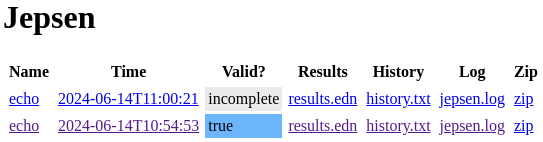
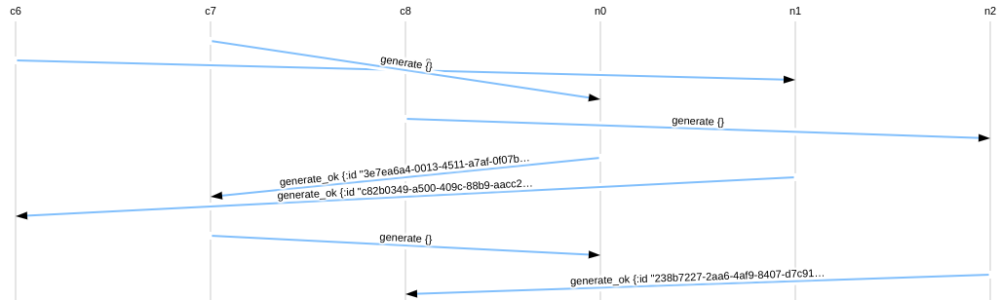

# Gossip Glomers

My solutions to the [Gossip Glomers](https://fly.io/dist-sys/) distributed systems challenges.

## Installation

### If you use Nix

This repository contains a `flake.nix` that declares a reproducible nix shell.

You can enter this shell and install all the dependencies by running [nix develop](https://nix.dev/manual/nix/2.13/command-ref/new-cli/nix3-develop). If you use [nix-direnv](https://github.com/nix-community/nix-direnv), you don't even have to type `nix develop`, and nix will automatically enter the shell when you `cd` into the project root directory.

### If you don't use Nix

In order to run Maelstrom, you will need to have the following dependencies on your system:

- JDK version 11 or higher (e.g. [OpenJDK](https://openjdk.org/), [Eclipse Temurin](https://adoptium.net/temurin/releases/))
- [Graphviz](https://graphviz.org/)
- [gnuplot](http://www.gnuplot.info/)

You can find more details on the [Prerequisites](https://github.com/jepsen-io/maelstrom/blob/main/doc/01-getting-ready/index.md#prerequisites) section on the Maelstrom docs.

### Download Maelstrom

The challenges are built on top of a platform called [Maelstrom](https://github.com/jepsen-io/maelstrom), which in turn, is built on [Jepsen](https://github.com/jepsen-io/jepsen).

Whether you are using Nix or not, you will need to download a recent release of Maelstrom.

```sh
wget "https://github.com/jepsen-io/maelstrom/releases/download/$MAELSTROM_VERSION/maelstrom.tar.bz2" && \
tar -xvf maelstrom.tar.bz2 && \
rm maelstrom.tar.bz2
```

### Install Node.js dependencies

Whether you are using Nix or not, you will need to install the Node.js dependencies.

```sh
npm install
```

## Test a solution against a workload

In order to test whether a Gossip Glomers solution is correct, you can tell Maelstrom to run it against a [workload](https://github.com/jepsen-io/maelstrom/blob/main/doc/workloads.md). Specify your program using the `--bin` flag, and `maelstrom test` will run it on one or more [nodes](https://github.com/jepsen-io/maelstrom/blob/main/doc/protocol.md#nodes-and-networks).

Your program doesn't have to be a binary. If it's a Node.js program, you just need to:

1. have Node.js installed
2. be able to execute that program (e.g. `chmod 755 program.js`)
3. have the appropriate shabang at the top (e.g. `#!/usr/bin/env node`)

### Babashka

Test the `echo.clj` program against the `echo` workload.

```sh
cd maelstrom

./maelstrom test -w echo \
  --bin ./demo/clojure/echo.clj \
  --node-count 1 --time-limit 10
```

### Go

Compile the `echo` binary.

```sh
mkdir maelstrom-echo
go get github.com/jepsen-io/maelstrom/demo/go
go install .
```

Test the `echo` program against the `echo` workload.

```sh
cd maelstrom

./maelstrom test -w echo \
  --bin ~/go/bin/maelstrom-echo \
  --node-count 1 --time-limit 10
```

### Node.js

Run a simple demo against the `echo.js` program.

```sh
node solutions/nodejs/echo.js demo
```

Test the `echo.js` solution against the `echo` workload (1 node, 10 seconds).

```sh
./maelstrom/maelstrom test -w echo \
  --bin ./solutions/nodejs/echo.js \
  --node-count 1 --time-limit 10
```

Test the `unique-ids.js` solution against the `unique-ids` workload.

```sh
./maelstrom/maelstrom test -w unique-ids \
  --bin ./solutions/nodejs/unique-ids.js \
  --availability total \
  --nemesis partition \
  --node-count 3 \
  --rate 1000 \
  --time-limit 30
```

### Node.js Single Executable Application

Compile the `echo.js` program as a Node.js [Single Executable Application](https://nodejs.org/api/single-executable-applications.html).

```sh
npm run sea:echo
```

> [!NOTE]
> The Node.js single executable application feature is still experimental, and it currently only supports running a **single embedded script** using the **CommonJS** module system. That's why I'm using esbuild to create a bundle of each solution.

Test the `echo` program against the `echo` workload (3 nodes, 15 seconds).

```sh
./maelstrom/maelstrom test -w echo \
  --bin ./solutions/nodejs-sea/echo/echo \
  --node-count 3 --time-limit 15
```

Compile the `unique-ids.js` solution and test it against the `unique-ids` workload.

```sh
npm run sea:unique-ids
npm run solution:unique-ids
```

### Zig example

TODO

## Troubleshooting

If a Maelstrom test fails, you can run the Maelstrom web server to inspect your results.

In one terminal, launch the Maelstrom (Jepsen) web server:

```sh
./maelstrom/maelstrom serve
```

In another terminal, test one of your solutions against a Maelstrom workload:

```sh
./maelstrom/maelstrom test -w echo \
  --bin ./solutions/nodejs/echo.js \
  --node-count 3 --time-limit 15

./maelstrom/maelstrom test -w echo \
  --bin ./maelstrom/demo/clojure/echo.clj \
  --node-count 2 --time-limit 10
```

Visit [http://localhost:8080](http://localhost:8080) in your browser to inspect the results.



Here you can see a few messages exchanged between Maelstrom clients (`c6`, `c7`, `c8`) and Maelstrom nodes (`n0`, `n1`, `n2`). These messages were sent during a test run of the `unique-ids` Maelstrom workflow.


